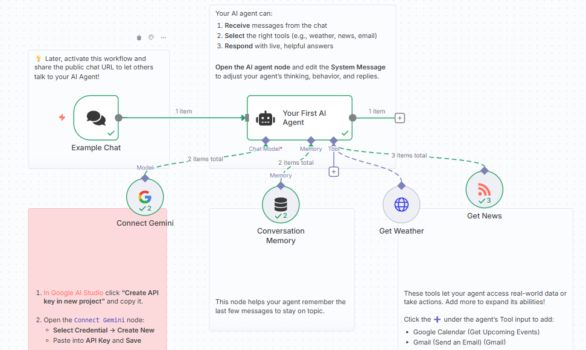

# AI-Powered News & Weather Agent on n8n

[](https://opensource.org/licenses/MIT)
[](https://n8n.io/)
[](https://ai.google.dev/)



## 📋 Overview

A conversational AI agent built on the n8n automation platform that provides real-time weather forecasts and news updates through natural language interaction. This project demonstrates how to create intelligent, tool-equipped agents that can seamlessly interact with multiple APIs and services without complex user interfaces.

## 🎯 The Task

**Objective**: Build an AI agent that can:
- Understand natural language requests
- Access real-time weather data for any location
- Fetch news updates from multiple RSS feeds
- Provide conversational responses through a chat interface
- Demonstrate the power of AI-driven workflow automation

**Use Case Examples**: 
> "What's the weather like in New York this week?"
> "Show me the latest tech news from TechCrunch"
> "Get me today's headlines from BBC World"

The agent intelligently interprets these requests, selects the appropriate tool, and delivers formatted responses.

## 🎥 Live Demo

Experience the AI agent in action:
- **Workflow JSON**: [`First_AI_Agent.json`](First_AI_Agent.json)
- **Interactive Chat**: Activate the workflow to get your public chat URL

## 🔧 Solutions & Architecture

### Problem Statement
Accessing multiple data sources typically requires:
- Visiting different websites or applications
- Manual API integration and authentication
- Complex UI development for data visualization
- Separate interfaces for each service

### Our Solution
This project leverages **n8n's AI Agent framework** to solve these challenges:

1. **Unified Interface**: Single chat interface for multiple services
2. **Natural Language Control**: Users describe needs in plain English
3. **Intelligent Tool Selection**: AI automatically chooses the right tool
4. **Conversational Context**: Memory enables multi-turn conversations
5. **No-Code Deployment**: Visual workflow builder, no programming required

### Technology Stack

#### 1. **n8n Workflow Automation**
- **Purpose**: Provides the automation platform and visual workflow builder
- **Why**: 
  - Low-code/no-code approach for rapid development
  - Built-in AI agent capabilities with LangChain integration
  - Easy deployment and sharing of chat interfaces
  - Extensive library of pre-built integrations

#### 2. **Google Gemini AI (PaLM API)**
- **Purpose**: Powers the conversational AI and decision-making
- **Why**: 
  - Fast inference for real-time chat responses
  - Excellent reasoning for tool selection
  - Cost-effective API pricing
  - Native integration with n8n
  - Temperature set to 0 for consistent, deterministic responses

#### 3. **LangChain Memory (Buffer Window)**
- **Purpose**: Maintains conversation context
- **Why**: 
  - Remembers last 30 messages for contextual understanding
  - Enables follow-up questions without repetition
  - Improves user experience with natural conversations

#### 4. **Available Tools**

##### **Get Weather Tool**
- **API**: Open-Meteo Forecast API
- **Capabilities**:
  - Current weather conditions
  - Hourly forecasts
  - Daily forecasts (7-day outlook)
  - Automatic latitude/longitude inference from city names
  - Configurable temperature units (Celsius/Fahrenheit)
- **Parameters**: 
  - Location (city name, auto-converted to coordinates)
  - Time period (current, hourly, or daily)
  - Weather variables (temperature, precipitation, wind, etc.)

##### **Get News Tool**
- **API**: RSS Feed Reader
- **Available Sources**:
  - **BBC World** - Global headlines
  - **Al Jazeera English** - In-depth global coverage
  - **CNN World** - Breaking news worldwide
  - **TechCrunch** - Global tech & startup news
  - **Hacker News** - Tech community headlines
  - **n8n Blog** - Platform updates & tutorials
  - **Bon Appétit** - Recipe updates
  - **ENDS Report** - Environmental law & policy
  - **MedlinePlus** - Health topics & wellness

## 🚀 Implementation Guide

### Prerequisites

- **n8n Instance**: Self-hosted or n8n Cloud account ([Get started](https://n8n.io/))
- **Google Gemini API Key**: ([Create one here](https://aistudio.google.com/app/apikey))
- Basic understanding of workflow automation concepts

### Step 1: Set Up n8n

**Option A: n8n Cloud (Easiest)**
```bash
# Sign up at https://n8n.io/cloud
# No installation required
```

**Option B: Self-Hosted (Docker)**
```bash
# Run n8n in Docker
docker run -it --rm \
  --name n8n \
  -p 5678:5678 \
  -v ~/.n8n:/home/node/.n8n \
  n8nio/n8n
```

**Option C: npm Installation**
```bash
# Install n8n globally
npm install n8n -g

# Start n8n
n8n start
```

Access n8n at: `http://localhost:5678`

### Step 2: Import the Workflow

1. Open n8n interface
2. Click **"Workflows"** → **"Add Workflow"** → **"Import from File"**
3. Select [`First_AI_Agent.json`](First_AI_Agent.json)
4. The workflow will be imported with all nodes and connections


### Step 3: Configure Google Gemini Credentials

1. **Get API Key**:
   - Visit [Google AI Studio](https://aistudio.google.com/app/apikey)
   - Click **"Create API key in new project"**
   - Copy the generated key

2. **Add Credentials to n8n**:
   - Open the **"Connect Gemini"** node
   - Click **"Credential to connect with"** → **"Create New"**
   - Select **"Google PaLM API"**
   - Paste your API key
   - Click **"Save"**

### Step 4: Activate the Workflow

1. Click the **"Active"** toggle in the top-right corner
2. The workflow is now live and ready to receive messages

### Step 5: Test the Chat Interface

1. Click on the **"Example Chat"** node
2. Click **"Test workflow"** or use the **"Chat"** button
3. Try sample queries:
   ```
   "What's the weather in London today?"
   "Show me the latest news from TechCrunch"
   "Get me BBC headlines"
   ```

### Step 6: Share Your Agent (Optional)

1. In the **"Example Chat"** node, the **"Public"** option is enabled
2. Copy the **public chat URL** provided by n8n
3. Share this URL with others to let them interact with your agent

## 📊 Workflow Structure

```
┌─────────────────┐
│  Example Chat   │ ← Chat Trigger (Public URL)
│   (Trigger)     │
└────────┬────────┘
         │
         ▼
┌─────────────────┐
│  Your First     │ ← AI Agent Node (Orchestrator)
│   AI Agent      │
└─┬─────┬───┬─────┘
  │     │   │
  │     │   └─────────────┐
  │     │                 │
  │     ▼                 ▼
  │  ┌──────────┐  ┌─────────────┐
  │  │   Get    │  │  Get News   │
  │  │ Weather  │  │   (RSS)     │
  │  └──────────┘  └─────────────┘
  │
  ▼
┌─────────────────┐
│  Conversation   │ ← Memory (30-message buffer)
│     Memory      │
└─────────────────┘
         ▲
         │
┌─────────────────┐
│ Connect Gemini  │ ← Language Model
│   (LLM Node)    │
└─────────────────┘
```

## 🔑 Key Features

- ✅ **Conversational Interface**: Natural language interaction
- ✅ **Multi-Tool Agent**: Automatic tool selection based on context
- ✅ **Context-Aware**: Remembers conversation history
- ✅ **Real-Time Data**: Live weather and news updates
- ✅ **Multiple News Sources**: Access to 9+ RSS feeds
- ✅ **Public Sharing**: Shareable chat URL for collaboration
- ✅ **Visual Workflow**: Easy-to-understand node-based design
- ✅ **Extensible**: Add more tools with simple node connections

## 🛠️ Customization Options

### Add More Tools

Extend your agent's capabilities by adding new tool nodes:

**Examples**:
- **Google Calendar** - Schedule management
- **Gmail** - Email operations
- **Slack** - Team notifications
- **Airtable** - Database operations
- **HTTP Request** - Custom API integrations

**How to Add**:
1. Click **"+"** under the agent's Tool input
2. Search for desired integration
3. Configure credentials and parameters
4. Connect to the agent node

### Modify System Prompt

Customize your agent's personality and behavior:

1. Open **"Your First AI Agent"** node
2. Edit the **"System Message"** field
3. Adjust tone, style, and capabilities
4. Save and test

### Adjust Memory Settings

Control conversation context:

1. Open **"Conversation Memory"** node
2. Modify **"Context Window Length"** (default: 30)
3. Higher values = longer memory (more context, slower responses)

### Change Temperature

Control response creativity:

1. Open **"Connect Gemini"** node
2. Adjust **"Temperature"** (0 = deterministic, 1 = creative)
3. Current setting: 0 for reliable, consistent responses

## 💡 Use Cases

### Personal Assistant
- **Daily Weather Briefings**: "What's my weather this week?"
- **News Digest**: "Give me today's tech headlines"
- **Multi-Source Research**: "Compare BBC and Al Jazeera coverage on [topic]"

### Business Applications
- **Market Intelligence**: Track industry news across multiple sources
- **Weather-Dependent Operations**: Get forecasts for logistics planning
- **Content Curation**: Aggregate news for newsletters or reports

### Educational Purposes
- **AI Agent Demonstration**: Show how LLMs interact with tools
- **Workflow Automation Training**: Teach n8n concepts
- **API Integration Examples**: Demonstrate multi-source data aggregation

## 🐛 Troubleshooting

### Common Issues

**Chat Interface Not Loading**
```bash
# Ensure workflow is activated (toggle in top-right)
# Check if n8n is running on correct port
# Verify public chat option is enabled
```

**API Key Not Working**
```bash
# Verify API key is correct in Google AI Studio
# Ensure credentials are saved in Connect Gemini node
# Check API quota limits in Google Cloud Console
```

**Weather Tool Not Responding**
```bash
# Tool automatically infers coordinates from city names
# Try being more specific: "London, UK" instead of just "London"
# Verify date format if using specific dates (YYYY-MM-DD)
```

**News Tool Returns Empty Results**
```bash
# Check if RSS feed URL is accessible
# Some feeds may be temporarily down
# Try a different news source
```

**Agent Not Using Tools**
```bash
# Verify tool nodes are connected to agent
# Check system message doesn't restrict tool usage
# Ensure query clearly matches tool capability
```

## 🎓 Learning Resources

### n8n Documentation
- [Getting Started Guide](https://docs.n8n.io/getting-started/)
- [AI Agent Node](https://docs.n8n.io/integrations/builtin/cluster-nodes/root-nodes/n8n-nodes-langchain.agent/)
- [LangChain Integration](https://docs.n8n.io/advanced-ai/)

### API Documentation
- [Open-Meteo Weather API](https://open-meteo.com/en/docs)
- [Google Gemini API](https://ai.google.dev/docs)
- [RSS Feed Standards](https://www.rssboard.org/rss-specification)

### Related Concepts
- [What is an AI Agent?](https://www.anthropic.com/research/building-effective-agents)
- [LangChain Agents Explained](https://python.langchain.com/docs/modules/agents/)
- [n8n Community Forum](https://community.n8n.io/)

## 🤝 Contributing

Contributions are welcome! Here's how you can help:

1. **Add New Tools**: Create and share tool configurations
2. **Improve System Prompts**: Enhance agent responses
3. **Documentation**: Add tutorials or examples
4. **Bug Reports**: Report issues with detailed reproduction steps

### Contribution Workflow

1. Fork the repository
2. Create your feature branch (`git checkout -b feature/NewTool`)
3. Make your changes to [`First_AI_Agent.json`](First_AI_Agent.json)
4. Export from n8n and commit (`git commit -m 'Add NewTool integration'`)
5. Push to the branch (`git push origin feature/NewTool`)
6. Open a Pull Request

## 📄 License

This project is licensed under the MIT License:

```
MIT License

Copyright (c) 2025


## 🙏 Acknowledgments

- **Lucas Peyrin** - Original workflow creator
- **n8n Team** - For the amazing automation platform
- **Google** - For Gemini AI capabilities
- **Open-Meteo** - For free weather API access
- **RSS Publishers** - For making news feeds available

## 📞 Support

Need help? Try these resources:

1. **n8n Community Forum**: [https://community.n8n.io/](https://community.n8n.io/)
2. **n8n Discord**: Join for real-time support
3. **Documentation**: Review n8n's official docs
4. **GitHub Issues**: Report bugs or request features

## 🚀 Next Steps

Ready to extend your agent? Try adding:

1. **Calendar Integration**: Schedule meetings via conversation
2. **Email Capabilities**: Send summaries or reports
3. **Database Connections**: Query and update data
4. **Custom APIs**: Integrate your own services
5. **Multi-Language Support**: Add translation tools
6. **Voice Interface**: Integrate speech-to-text

---

**Built with ❤️ using n8n, Google Gemini AI, and the power of workflow automation**

